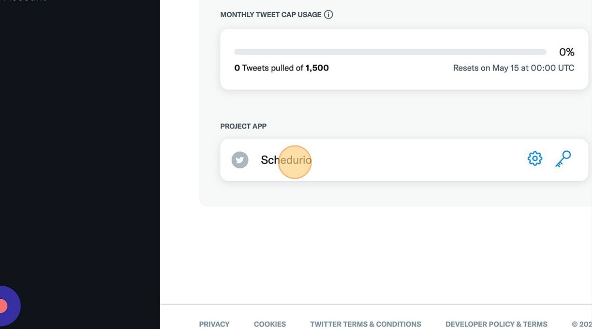

# Set up Schedurio app.

This is the guide to setup Schedurio app.

## Step-1

Navigate to [Twitter developer dashboard](developer.twitter.com/en/portal/dashboard)

## Step-2

Go or create a new app in your dashboard.

## Step-3

Click on this keys and tokens icon button.

## Step-4

Now it will show Cunsumer keys and Authentication tokens in the "keys and tokens" tab. Click on regenerate API key and API Secret from here.

## Step-5

Click "Yes, regenerate" if you want to regenerate it or if you don't have the API key and API Secret already.

## Step-6

Paste this API Key in the Schedurio app's First text field named API key. same goes for the second field. paste API key Secret in the second field.

## Step-7

Now this is the important key. since we have limited tweets we won't be authenticating other users. so grab Access Token and Access Token Secret directly from the dashboard by clicking on the generate/regenerate button.

